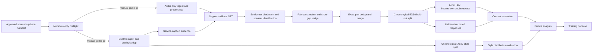

# winter-ai

로컬 중심 Personal Companion을 만드는 프로젝트입니다. 같은 사용자의 대화,
기억, 선호와 관계 맥락을 장기간 유지하면서 CLI와 Voice에서 하나의 정체성으로
동작하는 것을 목표로 합니다.

## Data and evaluation work inside Winter

Local-first Personal AI를 만들면서 실제 사람의 대화·음성 데이터를 private boundary 안에서
수집하고, 원본과 파생 데이터의 provenance를 남기며, 데이터 품질과 local LLM 응답을
held-out 방식으로 평가하는 파이프라인도 함께 구축하고 있습니다. 데이터가 믿을 만한지
먼저 확인하고, 결과가 낮을 때 model·prompt·input·pair construction·metric을 나눠
살펴보는 것이 이 작업의 기준입니다.

## Pipeline



`metadata preflight`와 ingest는 code-level automatic gate로 연결돼 있지 않습니다.
preflight exit status를 확인한 뒤 운영 절차에서 진행 여부를 결정합니다. 현재 content
평가는 merged pair JSON을 기록 순서대로 memory에서 나누며, 별도 split artifact를 만들지는
않습니다.

## Key evidence

| 관찰 | 확인한 결과 | 근거 |
| --- | --- | --- |
| Data quality | rolling caption overlap 때문에 기존 parser가 집계한 5,669자 중 37.4%가 중복으로 판명돼 제거됐고, 수정 후 3,547자가 됐습니다. | [case study](docs/data-quality-case-study.md), [`parse_webvtt()`](src/companion/reference_subtitle_probe.py) |
| Held-out content | 평가용 대화쌍은 전체 11→40→42개, held-out은 6→20→21개였고 `reference_broadcast`의 chance-relative position은 0.021→0.105→0.157이었습니다. | [evaluation case study](docs/llm-evaluation-case-study.md), [experiment](experiments/content_holdout_eval.py) |
| Style evaluation | 현재 10-run pooled speech-style distribution distance는 `base` 0.6388, `reference_broadcast` 0.1167, 자기 편차 기준선 0.1617입니다. | [ADR-0004](docs/adr/0004-training-decision.md), [style evaluation](docs/style-holdout-evaluation.md) |
| Provenance | audio ingest가 SHA-256, byte size, format, codec, sample rate, bitrate와 storage-relative path를 함께 기록합니다. | [audio ingest](src/companion/reference_audio_ingest.py), [ingest test](tests/unit/test_reference_audio_ingest.py) |
| Privacy boundary | private manifest, repository/storage overlap 거부, managed path 검증, mode 0600과 public/private report 분리를 적용했습니다. | [storage contract](docs/reference-data-storage.md), [storage tests](tests/unit/test_reference_storage.py) |

## What went wrong

### 1. rolling caption overlap

첫 자막 품질 측정은 틀렸습니다. 처음에는 사람이 만든 자막이 automatic caption보다 짧다고
판단했지만, automatic caption의 직전 cue 꼬리가 다음 cue 머리에 반복되는 구조를 parser가
충분히 제거하지 못하고 있었습니다. 기존 parser count 5,669자 중 37.4%가 중복으로 판명돼
제거됐고 수정 후 3,547자가 됐습니다. 재측정 뒤 사람 자막이 더 길다는 쪽으로 결론이
바뀌었습니다. 이 비율은 한 관측의 기존 parser count에서 제거된 몫이지, 전체 dataset의
중복률이나 모델 성능 변화가 아닙니다.

### 2. fragmented evaluation input

응답 점수가 낮았을 때 모델부터 바꾸지 않고 질문 pair가 어떻게 만들어졌는지 먼저
확인했습니다. 짧은 미배정 gap이 같은 화자의 transcript turn을 잘라 마지막 조각만 질문이
되는 경우가 있었습니다. 같은 화자의 짧은 gap을 이어 붙인 뒤 전체 pair는 40→42개,
held-out은 20→21개, 질문 평균 길이는 6.67→8.88단어가 됐고 chance-relative position은
0.105→0.157로 바뀌었습니다. pair 수도 함께 변했으므로 단일 인과 실험은 아니지만,
input fragmentation이 평가에 영향을 준 요인 중 하나임을 확인했습니다.

## How I evaluate the local LLM

Content 평가는 generated response와 한 개의 held-out recorded response를 비교합니다.
`similarity`는 정규화된 두 문자열의 순서 기반 유사도이고, `token_overlap`은 recorded
response의 고유 token 중 generated response에도 나타난 비율입니다. chance baseline은
각 held-out 답을 바로 다음 held-out 답과 비교한 평균입니다. chance-relative position은
generated similarity가 이 baseline에서 exact-match upper bound 1.0 쪽으로 얼마나
이동했는지를 나타냅니다. lower clamp가 없어 chance보다 낮으면 음수가 될 수 있으며,
accuracy나 response quality가 아닙니다.

Style 평가는 존댓말 비율, 발화 길이, 필러율과 종결 어미 구성의 speech-style distribution
distance만 측정합니다. 동일 reference의 앞 70%에서 profile을 다시 만들고 뒤 30%와
비교해, 전체 transcript로 profile을 만들고 같은 데이터로 평가하는 문제를 피했습니다.
자기 편차 0.1617은 이 source의 train portion과 held-out portion에서 관측한 기준선이지
사람 유사도의 절대 ground truth가 아닙니다.

제품 응답 경로에는 겪지 않은 경험과 없는 기억을 말하지 않도록 하는
[prompt-level grounding policy](src/companion/grounding.py)가 있습니다. 숫자·인용·부정
보존과 retry/fallback을 확인하는 `StyleRenderer`는
[offline/experimental preservation guard](docs/style-rendering.md)이며 아직
`CompanionCore`에 연결되지 않았습니다.

## Data boundary and provenance

실제 identity, source URI, raw media와 transcript는 repository 밖의 private external
storage에 둡니다. storage contract는 repository와 storage의 경로 중첩, unsafe relative
path, 알려지지 않은 top-level과 중복 ID를 거부하고 sentinel·manifest·report를 mode
0600으로 기록합니다. public summary에는 제한된 수치와 익명 ID만 두고 private report의
source metadata와 분리합니다. 알려진 private URI의 exact substring은 mask하지만 일반적인
PII 탐지나 자동 redaction, encryption-at-rest를 구현한 것은 아닙니다.

수집한 audio는 파일만 남기지 않고 SHA-256과 media metadata, storage-relative path를
manifest에 함께 기록합니다. `raw/derived/aligned/annotations/splits/artifacts/reports/quarantine`
layout은 저장 경계를 정의하지만, 전체 단계의 자동 lineage나 backup까지 완성된 것은
아닙니다.

## Why training was not the first step

처음부터 fine-tuning을 시작하지 않고 prompt 기반 baseline과 held-out 평가를 먼저
진행했습니다. 낮은 값에서 입력과 pair 구성을 다시 확인했고, style에서는 작은 run의
분산 때문에 10-run pooled 비교로 판정 방법을 바꿨습니다. 현재 측정만으로 바로 학습에
들어갈 component는 없다고 판단했습니다. 이는 fine-tuning이 불필요하다는 증명이 아니라,
어떤 문제가 prompt·입력 데이터·학습 중 어디에 있는지 구분하는 training decision gate에서
아직 착수하지 않은 상태라는 뜻입니다.

## Scope and limitations

### Implemented

- private registry와 external storage boundary, metadata-only preflight, public/private report
- subtitle quality probe, rolling overlap dedup, identical-track detection, audio provenance
- local STT, Sortformer diarization, speaker identification, pair construction와 short-gap bridge
- exact pair dedup, 시간순 content/style split, train/held-out exact pair overlap 실행 검사
- held-out content evaluation과 speech-style distribution evaluation

### Partial

- provenance는 audio와 manifest 경계를 기록하지만 end-to-end lineage 전체는 아닙니다.
- content 평가는 sample과 source가 작고, 질문마다 recorded response가 하나뿐입니다.
- privacy enforcement는 storage/path/permission/report 경계이며 일반 PII redaction은 없습니다.
- preservation guard는 offline test가 있지만 제품의 `CompanionCore` 경로에는 미연결입니다.

### Designed or planned

- source/date/interlocutor grouping guard와 semantic near-duplicate 검사는 설계 또는 미구현입니다.
- base model pretraining contamination을 확인하는 formal detector는 없습니다.
- SFT, LoRA, PEFT, voice cloning과 TTS adaptation은 시작하지 않았습니다.

## Deep dives

- [Rolling caption data quality case study](docs/data-quality-case-study.md)
- [LLM held-out evaluation and failure analysis](docs/llm-evaluation-case-study.md)
- [Data and evaluation evidence map](docs/llm-data-eval-evidence-map.md)
- [Short project summary](docs/llm-data-eval-portfolio-summary.md)
- [Reference data storage contract](docs/reference-data-storage.md)
- [Training decision record](docs/adr/0004-training-decision.md)

---

## 현재 상태

Milestone 0의 기반 구조, Milestone 1의 CLI 경로, Milestone 2의 Identity·명시적
Memory lifecycle이 준비되어 있습니다. Docker 개발 이미지, Python 패키지, Port 계약,
deterministic fake adapter, 공유 `CompanionCore`, CLI/Voice orchestration 테스트를
갖췄습니다. 실제 local llama.cpp server를 선택하면 CLI가 `CompanionCore`를 거쳐
Qwen3 응답을 받습니다. 대화는 SQLite에 영속화되며, Local CLI는 제한된 최근 대화
context를 다음 요청에 포함합니다. 실제 Voice adapter는 아직 구현하지 않았습니다.

Memory는 대화의 명시적 `기억해` 요청에서만 후보로 생성되고, 사용자 검토 뒤에만
활성화됩니다. 수정 이력, 논리적 폐기, 명시적 물리 삭제를 지원합니다. M2의 수직 단면
검증 결과와 알려진 한계는 [M2 검증 문서](docs/milestone-2-validation.md)에 기록합니다.

Voice Identity 0.1은 Python config의 `neutral`, `calm`, `warm`, `serious` Prosody
profile로 시작합니다. 이는 실제 음색 모델과 분리된 말하기 계획이며, 설계 초안은
[Voice 설계 문서](docs/voice-design.md)에 기록합니다.

다음 단계는 [Milestone 4 — Human Reference Baseline](https://github.com/WK-Hanelso/winter-ai/issues/66)입니다.
실제 한 사람의 대화 맥락, 말투, 분위기와 목소리를 같은 시간축에 정렬하고, CLI와 Voice가
공유할 수 있는 행동 기준선을 먼저 검증합니다. CLI는 shared lexical response를 표시하고,
Voice는 동일한 text와 delivery plan을 local TTS로 실현합니다. 결합 기준 설계 #67은
완료됐고 Reference 선정 기준 #69와
[외장 storage 계약 #71](https://github.com/WK-Hanelso/winter-ai/issues/71)도 확정했습니다.
멀티모달 장면 schema #73도 완료해 맥락·전후 분위기·원문/정규화 문장·음성 전달을
source-relative 시간축에 정렬하고 검증할 수 있습니다. 현재 작업은
[소규모 수집·정렬 probe #75](https://github.com/WK-Hanelso/winter-ai/issues/75)입니다.
제한된 private source pilot로 metadata probe, audio ingest, subtitle quality, local STT,
diarization과 held-out evaluation을 검증했습니다. 전체 video ingest와 Qwen/TTS 학습은
시작하지 않았습니다.
실제 source 접근 전에는 Reference Human, 승인할 source 목록과 전용 외장 storage 절대경로를
사용자에게 확인하며, 이 값은 public GitHub에 기록하지 않습니다.
구조, 데이터 경계와 학습 decision gate는
[Human Reference 설계](docs/human-reference-design.md), [ADR-0002](docs/adr/0002-coupled-human-reference-baseline.md),
[선정 기준](docs/reference-human-selection.md), [외장 storage](docs/reference-data-storage.md),
[장면 schema](docs/reference-scene-schema.md), [roadmap](docs/roadmap.md)에 기록합니다.

## 겨울이 시작하기

먼저 `.env.example`을 `.env`로 복사해 local model 경로를 채운 뒤, 아래 명령으로
시작합니다. 대화·기억·Identity는 모두 Host의 `data/`에 지속 저장됩니다. `start`는
LLM 서버를 시작하고 health 확인을 마친 뒤에만 겨울이 CLI를 엽니다.

```bash
cp .env.example .env
# .env의 LLAMA_RUNTIME_DIR, LLM_MODEL_DIR, LLM_MODEL_FILE을 수정
./winter start
```

개발 중 모델 없이 화면 흐름만 확인하려면 `--backend fake`를 명시합니다.

```bash
docker compose run --rm dev python -m companion.user_cli --backend fake
```

이미 실행 중인 겨울이에 다시 연결하려면 `./winter chat`, 상태 확인은
`./winter status`, 모델 서버를 멈추려면 `./winter stop`을 사용합니다.

겨울이의 대답을 소리로 들으려면 `./winter voice`를 사용합니다. 타자로 묻고
음성으로 듣는 경로이며, 마이크 입력은 아직 없습니다.

```bash
./winter voice                      # 대화
./winter voice --say "안녕" --no-play  # 한 문장만, 재생 없이 wav로
```

`voice`만은 다른 명령과 달리 dev container가 아닌 **Host에서** 실행됩니다.
합성이 `docker run`을, 재생이 Host 사운드 장치를 필요로 하기 때문입니다. 그래서
`voice`는 모델 서버를 Host loopback(`127.0.0.1:8080`)에도 공개하며, 이는
`compose.llm-host.yaml` overlay로 분리해 두어 다른 명령에는 영향이 없습니다.
자세한 구조와 시행착오는 [음성 출력 경로](docs/voice-path.md)에 있습니다.

첫 Local LLM probe도 성공했습니다. Docker 안의 llama.cpp Vulkan runtime으로
Qwen3-4B-Instruct-2507 Q4_K_M을 RTX 2060 6 GiB에서 실행했고, 37/37 레이어가
GPU에 올라간 상태로 한국어 응답을 생성했습니다. 정확한 모델 출처·해시·성능은
[모델 선정 문서](docs/model-selection.md)에 기록합니다.

한국어 STT도 Whisper small과 공개 Zeroth-Korean fixture로 local CPU 전사에
성공했습니다. 현재 NVIDIA driver와 공식 CUDA image의 요구 버전이 맞지 않아 STT
CUDA 경로는 명시적으로 실패하며, 이 제한과 CPU 결과를 같은 문서에 기록합니다.

한국어 TTS는 MeloTTS로 local WAV 합성에 성공했습니다. 이는 독립 runtime probe이며
아직 Human Reference Voice 재현이나 최종 Companion Voice를 검증한 결과는 아닙니다.

CPU 개발 환경을 기본값으로 두고, GPU와 Voice 장치는 명시적인 Compose overlay에서만
전달합니다. 선택 근거는 [ADR-0001](docs/adr/0001-docker-development-baseline.md)에
있습니다.

## 개발 원칙

- Docker-first: 애플리케이션과 의존성은 컨테이너에서 실행합니다.
- Local-first: 초기 대화 기능은 외부 상용 LLM API에 의존하지 않습니다.
- Shared Core: CLI와 Voice는 하나의 `CompanionCore`를 공유합니다.
- Coupled Reference: Human Reference의 context, 말투, 분위기와 음성을 함께 정렬합니다.
- Offline tests: 기본 테스트는 인터넷, GPU, 마이크, 모델 가중치, API 키 없이 실행됩니다.
- Privacy: 원본 영상·음성·자막, Reference corpus, 대화 DB, 모델 파일과 비밀 정보는 Git에 저장하지 않습니다.

Host와 Container의 책임, 조사된 환경 사양, 재확인해야 할 항목은
[환경 기준 문서](docs/environment.md)에 기록합니다.

## 작업 방식

모든 작업은 GitHub Issue로 시작하며, 기능·버그·조사·설계 결정을 동일한
상태 전이 형식으로 기록합니다. 원격 저장소에 push하기 전에는 README가 변경된
프로젝트 상태와 사용 방법을 정확히 반영하는지 확인합니다.

세부 제품·아키텍처·개발 규칙은 [AGENTS.md](AGENTS.md)를 기준으로 합니다.

## Companion Identity

Companion의 이름·역할·핵심 성격·가치관·관계 원칙·변경 불가 경계는 model prompt와
분리된 JSON Identity로 관리합니다. 파일은 개인 설정이므로 `data/` 아래에 두며 Git에
넣지 않습니다. 현재 초기 이름은 **겨울이**이며, 그 밖의 Core Persona는 사용자 승인
없이 자동 변경하지 않습니다. 형식은 [Identity 문서](docs/identity.md)를 따릅니다.

```bash
docker compose run --rm dev python -m companion.cli \
  --identity-path /workspace/data/identity.json --show-identity
```

## Explicit Memory lifecycle

일반 대화는 자동으로 영구 기억이 되지 않습니다. 사용자가 명시적으로 저장한 항목은
처음 `candidate`가 되고, 검토 뒤 `approved`, 그 다음 `active`로 전이합니다.

```bash
docker compose run --rm dev python -m companion.cli \
  --memory-db /workspace/data/memories.sqlite \
  --memory-add "천우가 명시적으로 기억해 달라고 한 내용"

docker compose run --rm dev python -m companion.cli \
  --memory-db /workspace/data/memories.sqlite --memory-approve <memory-id>

docker compose run --rm dev python -m companion.cli \
  --memory-db /workspace/data/memories.sqlite --memory-activate <memory-id>
```

기억의 내용을 바꿀 때는 기존 행을 덮어쓰지 않습니다. `--memory-replace`는 새
`candidate`를 만들고 기존 기억의 ID를 `supersedes`로 기록합니다. 새 항목이
`active`가 되는 순간에만 기존 active 항목을 `deprecated`로 전환하므로, 검토 중인
수정 때문에 현재 기억을 잃지 않습니다.

```bash
docker compose run --rm dev python -m companion.cli \
  --memory-db /workspace/data/memories.sqlite \
  --memory-replace <memory-id> "수정할 내용"

docker compose run --rm dev python -m companion.cli \
  --memory-db /workspace/data/memories.sqlite --memory-deprecate <memory-id>

docker compose run --rm dev python -m companion.cli \
  --memory-db /workspace/data/memories.sqlite --list-memories
```

`deprecated`는 이력 보존을 위한 논리적 삭제입니다. 완전히 제거하려면 목록에서 ID를
확인한 뒤 아래처럼 명시적으로 삭제합니다. 다른 Memory가 해당 ID를 `supersedes`로
참조하면 이력 보호를 위해 삭제가 거부됩니다.

```bash
docker compose run --rm dev python -m companion.cli \
  --memory-db /workspace/data/memories.sqlite --memory-delete <memory-id>
```

자동 conflict 판정은 아직 제공하지 않습니다. 현재는 active Memory 중 현재 질문과
keyword가 겹치는 최대 3개·총 1,000자만 별도 system context로 Local LLM에 전달합니다.
candidate·approved·deprecated·rejected Memory는 절대 전달되지 않습니다.

대화에서 기억을 제안하려면, 내용과 함께 명시적으로 `기억해` 또는 `기억해줘`로
시작합니다. 예를 들어 아래 입력은 candidate를 하나 만들고, CLI가 후보 ID를 출력합니다.
Companion은 “기억 후보로 저장했어”라고 안내하며, Voice도 같은 안내를 음성으로
재생합니다. 후보는 앞의 승인·활성화 명령을 실행하기 전까지 모델 context에 사용되지
않습니다.

```bash
docker compose run --rm dev python -m companion.cli \
  --backend fake \
  --memory-db /workspace/data/memories.sqlite \
  --prompt "기억해. 나는 Python config를 선호해"
```

일반 발화나 내용 없는 `기억해`는 후보를 만들지 않습니다. 모호한 표현 해석, 자동
교체·활성화, LLM 기반 기억 추출은 아직 제공하지 않습니다.

## 개발 환경 스펙

| 구분 | 기준 |
| --- | --- |
| Container Python | 3.11 |
| 기본 이미지 | `python:3.11-slim-bookworm` |
| 기본 실행 | CPU-only Docker Compose 서비스 `dev` |
| GPU | RTX 2060 6 GiB를 Host에서 확인; `compose.gpu.yaml`을 명시할 때만 전달 |
| Voice | PulseAudio/ALSA를 Host에서 확인; `compose.voice.yaml`과 Pulse socket을 명시할 때만 전달 |
| 모델·개인 데이터 | 이미지와 Git에서 제외, `data/`·`models/` bind mount로만 전달 |

## Docker 실행

기본 CPU 개발 셸을 build하고 Python runtime을 확인합니다.

```bash
docker compose build
docker compose run --rm dev python --version
```

`dev` 서비스는 Docker `local` logging driver를 사용하며, 로그는 10MB 파일 3개로
제한된다. 장시간 model probe가 Host 디스크를 과도하게 점유하지 않게 하기 위한 설정이다.

GPU 장치가 필요한 후속 adapter 작업에서만 GPU overlay를 명시합니다.

```bash
docker compose -f compose.yaml -f compose.gpu.yaml run --rm dev bash
```

Voice 작업에서는 먼저 `.env.example`을 `.env`로 복사하고 Host의 실제
PulseAudio socket 경로를 확인한 뒤 Voice overlay를 명시합니다.

```bash
docker compose -f compose.yaml -f compose.voice.yaml run --rm dev bash
```

기본 CLI는 의도적으로 fake adapter를 사용합니다. 이는 오프라인 개발과 테스트를
모델 서버의 상태에서 분리하기 위한 명시적 선택이며, `--backend local`이 실패해도
fake 응답으로 자동 전환하지 않습니다.

```bash
docker compose run --rm dev python -m companion.cli --backend fake --prompt "안녕"
```

실제 local LLM CLI는 Host의 runtime과 모델을 **read-only** mount한 `llm` 서비스와,
그 서비스에만 접속하는 `dev` CLI 컨테이너로 구성됩니다. 아래 변수 경로는 Host
경로이고, 컨테이너에서는 각각 `/runtime`, `/models`로만 보입니다.

```bash
export LLAMA_RUNTIME_DIR=/path/to/llama-b10276-parent
export LLM_MODEL_DIR=/path/to/gguf-directory
export LLM_MODEL_FILE=Qwen3-4B-Instruct-2507.Q4_K_M.gguf

docker compose -f compose.yaml -f compose.llm.yaml -f compose.gpu.yaml up -d llm
docker compose -f compose.yaml -f compose.llm.yaml -f compose.gpu.yaml run --rm dev \
  python -m companion.cli --backend local --prompt "한국어로 한 문장만 인사해줘"
docker compose -f compose.yaml -f compose.llm.yaml -f compose.gpu.yaml down
```

`LLAMA_RUNTIME_DIR`에는 그 아래에 `llama-b10276/llama-server`가 있는 디렉터리를
지정합니다. `llm`은 Host port를 공개하지 않으며 Compose 내부 `http://llm:8080`에서만
통신합니다.

대화를 프로그램 재시작 뒤에도 보존하려면 명시적으로 SQLite 경로를 지정합니다.
Docker 실행에서는 컨테이너 내부 `/tmp`가 실행마다 사라지므로, Host의 `./data`와
연결된 `/workspace/data` 아래를 사용합니다. `data/`와 `*.sqlite`는 Git에서 제외됩니다.
Host에서 DB를 직접 수정·삭제할 수 있도록, 처음 한 번 현재 사용자 UID/GID를 넘깁니다.

```bash
export LOCAL_UID=$(id -u)
export LOCAL_GID=$(id -g)

docker compose run --rm dev python -m companion.cli \
  --backend fake \
  --conversation-db /workspace/data/conversations.sqlite \
  --prompt "이 대화를 저장해줘"

docker compose run --rm dev python -m companion.cli \
  --backend fake \
  --conversation-db /workspace/data/conversations.sqlite \
  --show-history
```

현재 저장하는 것은 순서가 있는 원문 대화 기록뿐입니다. Local CLI는 기본적으로 최근
12개 메시지와 총 4,000자 안의 기록을 다음 모델 요청에 함께 넣습니다. 필요하면
`--context-max-messages`, `--context-max-characters`로 한도를 낮출 수 있습니다.
이는 당장 대화 흐름을 잇기 위한 context입니다. 장기 기억은 명시적 저장과 lifecycle을
통해서만 관리하며, 자동 영구 저장하지 않습니다.

테스트는 다음 명령으로 실행합니다.

```bash
docker compose run --rm dev pytest
```

lint와 type check는 다음 명령으로 실행합니다. 세 명령 모두 통과해야
`AGENTS.md`의 Definition of Done을 만족합니다.

```bash
docker compose run --rm dev ruff check .
docker compose run --rm dev mypy
```

규칙은 `pyproject.toml`의 `[tool.ruff]`와 `[tool.mypy]`에 있습니다. 완화한
항목에는 그 이유를 주석으로 적었습니다.

실제 LLM checkpoint는 Git과 Docker 이미지에 넣지 않습니다. 내려받은 파일의 경로를
명시해 Host에서 다음 수동 probe를 실행할 수 있습니다.

```bash
python3 experiments/local_llm_probe.py \
  --runtime-dir /path/to/llama-b10276 \
  --model-path /path/to/Qwen3-4B-Instruct-2507.Q4_K_M.gguf
```

이 probe는 Docker GPU를 사용하며, 파일을 read-only로 mount합니다. 모델 파일의
정확한 SHA-256과 검증 결과는 [모델 선정 문서](docs/model-selection.md)를 따릅니다.

한국어 STT CPU probe는 다음처럼 실행합니다.

```bash
python3 experiments/stt_probe.py \
  --model-path /path/to/ggml-small.bin \
  --audio-path /path/to/korean-fixture.flac
```

한국어 TTS probe는 별도 pinned Docker image를 build한 뒤 실행합니다.

```bash
docker build -f Dockerfile.melotts-probe -t winter-ai:melotts-probe .
python3 experiments/tts_probe.py \
  --cache-dir /path/outside/git/melotts-cache \
  --output-path /path/outside/git/melotts-korean.wav
```

Human Reference source의 메타데이터 preflight probe는 별도 pinned image로
실행합니다. media를 다운로드하지 않고 duration, audio format, 자막 언어만
조회합니다. 외장 storage mount와 `.env`의 `REFERENCE_STORAGE_ROOT`,
`REFERENCE_STORAGE_ID`가 필요합니다.

```bash
docker compose -f compose.reference-source.yaml run --rm reference-source-probe \
  --candidate-id <candidate-id> \
  --report-relative-path reports/<name>.json
```

실행 규약, 실패 정책, 설계 결정은
[source metadata preflight 문서](docs/reference-source-probe.md)를 따릅니다.

자막이 `raw_transcript`로 쓸 수 있는 품질인지 측정하는 probe는 같은 image에서
텍스트만 내려받아 실행합니다.

```bash
docker compose -f compose.reference-source.yaml run --rm reference-subtitle-probe \
  --candidate-id <candidate-id> \
  --report-relative-path reports/<name>.json \
  --duration <source-id>=<seconds>
```

측정 지표와 판정 기준은
[자막 품질 측정 문서](docs/reference-subtitle-quality.md)를 따릅니다.

승인된 source의 오디오를 수집할 때는 한 번에 하나씩, 재인코딩 없이 받습니다.

```bash
docker compose -f compose.reference-source.yaml run --rm reference-audio-ingest \\
  --candidate-id <candidate-id> \\
  --source-id <source-id> \\
  --report-relative-path reports/<name>.json \\
  --expected-duration-seconds <seconds>
```

수집 계약과 실패 정책은
[오디오 수집 문서](docs/reference-audio-ingest.md)를 따릅니다.

승인된 candidate와 source 등록은 전용 명령으로 합니다. manifest를 직접 편집하지
않습니다.

```bash
docker compose -f compose.reference-source.yaml run --rm reference-source-register --list
docker compose -f compose.reference-source.yaml run --rm reference-source-register \\
  --add-source <candidate-id> --source-uri <URI>
```

URI는 외장 private manifest에만 저장되며 stdout과 report에는 나오지 않습니다.

수집한 오디오의 전사 품질은 구간 단위로 측정합니다. whisper.cpp image에 ffmpeg가
포함돼 있어 자르기·리샘플·전사가 한 runtime에서 끝납니다.

```bash
PYTHONPATH=src python3 experiments/reference_transcription_probe.py \\
  --audio-path <외장>/raw/audio/<candidate>/<source>.webm \\
  --reference-vtt <외장>/raw/subtitles/<candidate>/<source>.ko-orig.vtt \\
  --model-path <모델>/ggml-small.bin \\
  --work-dir <외장>/derived/audio/stt-pilot \\
  --source-id <source-id> --start-seconds 600 --duration-seconds 300
```

측정 방법과 결과는
[STT 파일럿 문서](docs/reference-transcription-probe.md)를 따릅니다.

전사에서 말투 특성을 추출할 때는 대조 전사를 함께 측정합니다. 두 전사에 모두
나타나는 특성만 설계 근거로 씁니다.

```bash
PYTHONPATH=src python3 experiments/reference_speech_style.py \\
  --source-id <source-id> \\
  --transcript <외장>/derived/audio/stt-pilot/<source>-0-<duration>.vtt \\
  --secondary-transcript <외장>/raw/subtitles/<candidate>/<source>.ko-orig.vtt \\
  --report-path <외장>/reports/<name>.json
```

측정 항목과 결과는
[말투 특성 문서](docs/reference-speech-style.md)를 따릅니다.

초기 speaker-verification 방식은 동작하지 않았고, 현재는 Sortformer diarization으로
speaker span을 붙인 뒤 별도 speaker identification을 수행합니다. 초기 실패 경위는
[화자 검증 문서](docs/speaker-verification.md), 현재 방식은
[diarization 문서](docs/diarization.md)에 있습니다.

말투는 `configs/verbal_style/`의 Python profile로 관리합니다. 기본값은
`reference_broadcast`이며 Reference 측정에 근거합니다. 이전 정책은 `base`로 남겨
비교할 수 있습니다.

```bash
docker compose run --rm dev python -m companion.cli --backend fake \\
  --verbal-style reference_broadcast --prompt "안녕"
```

근거와 한계는 [말투 profile 문서](docs/verbal-style-profiles.md)를 따릅니다.

모델 선택값은 `configs/models/`의 Python profile로 관리합니다. 기본값은 `base`,
RTX 2060 6 GiB profile은 `rtx2060_6gb`(Vulkan GPU backend, 37 layers), CPU
profile은 `cpu`입니다.
